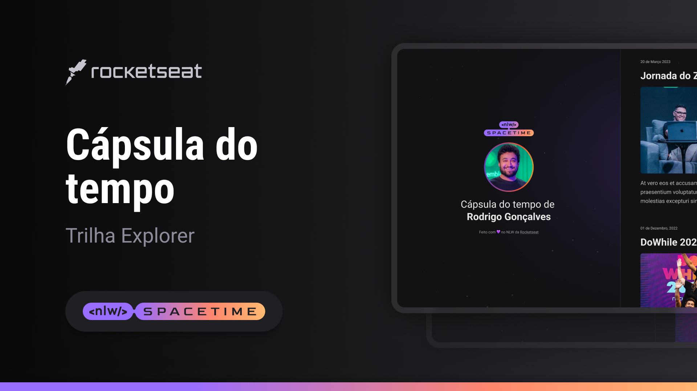

    

## 🖥️ Project 

Projeto web responsivo de uma cápsula do tempo para exibir memórias numa timeline

## 🚀 Tech Tools

Project developed during Next Level Week of Rocketseat with:

- HTML
- CSS
- Git e Github

## 🏷️ Layout

Project layout available on:

[link] (https://www.figma.com/file/7S7ACCPHh1XjpdJsbtvFH1/C%C3%A1psula-do-tempo-%E2%80%A2-Trilha-Explorer-(Community)?type=design&node-id=0%3A1&t=NFnFE48kje9kckFe-1).
You need access to [Figma](https://www.figma.com)

